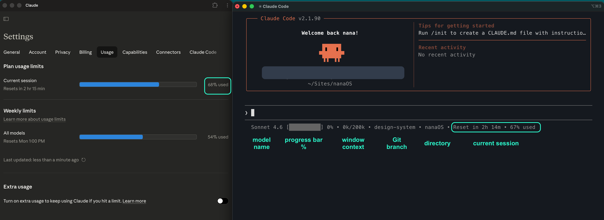

# Claude Code Statusline

A single-line status bar for [Claude Code](https://claude.ai/code) that shows model, context usage, git branch, session limits, and reset timer — all in real-time with no token cost.

```
Sonnet 4.6 [██████████] 29% • 1k/200k • main • myproject • Reset in 2h 52m • 38% used
```



---

## What it shows

| Segment          | Source                                                                  |
| ---------------- | ----------------------------------------------------------------------- |
| Model name       | `model.display_name` from Claude Code JSON                              |
| Progress bar + % | `context_window.used_percentage` (current conversation)                 |
| Token usage      | `context_window.current_usage.input_tokens` / `context_window_size`     |
| Git branch       | `git symbolic-ref` from the current working directory                   |
| Directory        | `basename` of `workspace.current_dir`                                   |
| Reset timer      | `rate_limits.five_hour.resets_at` — same as Settings > Usage page       |
| Session % used   | `rate_limits.five_hour.used_percentage` — same as Settings > Usage page |

> **No tokens are consumed.** Claude Code passes all data via JSON stdin each time it renders the status bar. There are no API calls.

---

## Design

- Progress bar uses `█` for both filled and empty segments (same glyph = uniform height). Empty = dimmed `#646464`.
- Filled segment color changes by usage level:

| Range  | Color            | Code      |
| ------ | ---------------- | --------- |
| 0–50%  | Terminal default | —         |
| 51–70% | Yellow           | `#FFC469` |
| 71%+   | Red              | `#FF7979` |


- No truncation — all values are shown in full.
- Separator: `•`

---

## Install

### 1. Copy the script

```bash
curl -o ~/.claude/statusline.py \
  https://raw.githubusercontent.com/nanacodesign/claude-code-statusline/main/statusline.py
```

Or manually copy `statusline.py` to `~/.claude/statusline.py`.

### 2. Edit `~/.claude/settings.json`

Add (or update) the `statusLine` key:

```json
{
  "statusLine": {
    "type": "command",
    "command": "python3 ~/.claude/statusline.py"
  }
}
```

### 3. Restart Claude Code

The status bar appears immediately after restarting.

---

## Requirements

- macOS (tested) or Linux
- Python 3 (pre-installed on macOS)
- Claude Code CLI >= 2.1.x (needs `rate_limits` field in statusline JSON)
- `git` in `$PATH` (optional — shows `-` if not available)

---

## Known Issues & Fixes

### Session data shows 0% / Reset in 5h 0m on startup

**Symptom:** Right after launching Claude Code, the status bar shows `Reset in 5h 0m • 0% used` even though the Settings > Usage page shows the correct values.

**Root cause:** Claude Code only populates `rate_limits` in the statusline JSON after the first API call in a session. On a fresh start (idle screen, no conversation yet), the field is absent.

**Fix:** The script caches the last known `rate_limits.five_hour` values to `/tmp/claude_rate_limits_cache.json` whenever real data is received. On the next startup, it loads from cache instead of defaulting to zero. The `resets_at` value is an absolute epoch timestamp, so the countdown remains accurate even when served from cache.

---

## Files

| File                                 | Purpose                                                   |
| ------------------------------------ | --------------------------------------------------------- |
| `~/.claude/statusline.py`            | The status bar script                                     |
| `~/.claude/settings.json`            | Points Claude Code to the script via `statusLine.command` |
| `/tmp/claude_rate_limits_cache.json` | Runtime cache for session data (auto-created)             |

---

## Try & Share

> Love this? Please share your statusline and <a href="https://www.linkedin.com/in/nanacodesign/">tag me</a>! <br>
> I'd love to see how it looks in your setup.🤩

- ⭐ **Star the repo**
- 💎 **[Report bugs or share idea](../../issues)**

---

## About nana

AI-native product designer based in Sydney, from Seoul. 🇦🇺 🇰🇷

Solving complex user problems and shaping them into clear, accessible, and delightful experiences — using AI agents and tools to build fast, validate fast, and grow fast.

I'd love to connect! ☕️ 🧙🏻

<p>
  <a href="https://www.linkedin.com/in/nanacodesign/">🔗 LinkedIn</a>
  <br>
  <a href="http://nanacodesign.com">🌐 nanacodesign.com</a>
  <br>
  <a href="mailto:nanacodesigner@gmail.com">💌 nanacodesigner@gmail.com</a>
</p>
